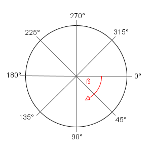

======================
Movement Controller
======================

Important Notes
-----------------

The movement controller moves your player in the requested direction until you reach the given distance or until you reach an obstacle. 

Please note that angle should be passed as degrees, where each degree turns in the clockwise direction ( counterintuitively ). Refer to the 
below image.

The shooter max speed is 25 units. 

The movement controller will often place you beyond your desired location. This is not a bug, but instead a realistic modeling of inertia.

Example
------------

.. code-block:: python

    actions.set_move(int(45), shooter.max_speed)

will send you towards the bottom right corner (assuming you're in the middle) 25 units (assuming there are no obstacles)