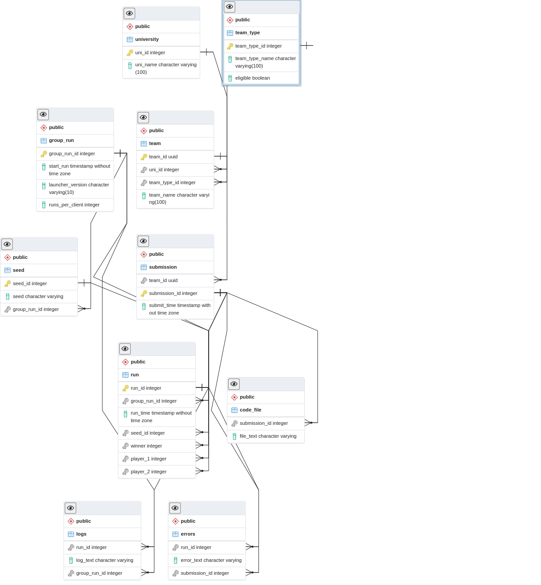

======================
Server Documentation
======================

Important Info!
================

There is a new server this year and it improves on the previous server in two major ways

1. More information is stored and kept in the database
2. You can access this information through the client

This functionality is optional, and the below section highlights the commands you need to know

Group runs
------------

Unlike previous years, clients will be run together at a distinct point in time, known as a group run. The 
benefit to group runs is that you can fetch information relating to each group run (such as launcher version!)
and view your progress (or regression) over time!

The downside is that there is no "queue" like previous years, and you have to wait for the group run to complete 
before your next client is run. 

Other cool features
---------------------

1. HTTPS!
2. Rate Limiting!
    1. Note that the default rate limit is 1 / second
3. Seed downloading!
4. Client Downloading!
5. SQL!
6. ASCII table and CSV output!
7. Client Validation

The Important commands that you need to know!
================================================

Registering
------------

**Rate Limit: 10 / hour**

Registering is required to recieve your VID ( Don't share with anyone!) which in turn allows you to submit clients and view 
team specific information. If your teamates wish to upload to the server, you'll have to send them the vID.

.. code-block:: python

    python launcher.pyz client -register

you will then be prompted to enter information

submiting clients
--------------------

**Rate Limit: 1/minute**

.. code-block:: python

    python launcher.pyz client -submit

Once you've registered, you can submit your client. At least one client must be submitted by 10pm to be elligible to win. The server will automatically look for files in the 
root directory that contain the word 'client'. Otherwise, you can manually select the file. Once you've confirmed the file, it will be uploaded to the server and 
then run against other clients to determine placing. Feel free to submit as many times as you like, but please refrain from excessive uploads.

leaderboard
--------------

**Rate Limit: 5/minute**

.. code-block:: python

    python launcher.pyz client leaderboard

Returns the leaderboard for elligible contestants. Alumni will want to run the command

.. code-block:: python

    python launcher.pyz client leaderboard -include_alumni

Also note you can retrieve the leaderboard for previous group runs using

.. code-block:: python

    python launcher.pyz client leaderboard -group_id <group_run_id>

view stats
------------

**Rate Limit: 5/minute**

.. code-block:: python

    python launcher.pyz client stats

Returns stats relating to your submissions(s). All stats relate to your most recent submission. Please note that the stats will continue to change until all 
runs are completed.

Other Fun Commands!
=====================

Note on output
-----------------

Some of the tables from the commands can be quite large. You can write these large results to a file using the > opperator. EX:

.. code-block:: python

    python launcher.pyz client stats -runs_for_group_run <group_id> > output.txt

You can also specify csv output if desired by passing the -csv flag to the server parser. EX:

.. code-block:: python

    python launcher.pyz client -csv leaderboard > output.csv

runs for group run
-------------------

**Rate Limit: 5/minute**

.. code-block:: python

    python launcher.pyz client stats -runs_for_group_run <group_id>

Returns all of a team's runs for a given group run

runs for submission
---------------------

**Rate Limit: 5/minute**

.. code-block:: python

    python launcher.pyz client stats -runs_for_submission <submission_id>

Returns all of the runs for a given submission

get submissions
-----------------

**Rate Limit: 5/minute**

.. code-block:: python

    python launcher.pyz client stats -get_submissions

Returns all of the submissions for a team

get group runs
-----------------

**Rate Limit: 5/minute**

.. code-block:: python

    python launcher.pyz client stats -get_group_runs

Returns all of the group runs a team participated in

get code for submission
-------------------------

**Rate Limit: 1/minute**

.. code-block:: python

    python launcher.pyz client stats -get_code_for_submission <submission_id>

Returns code for a given submission

get errors for submission
-------------------------

**Rate Limit: 1/minute**

.. code-block:: python

    python launcher.pyz client stats -get_errors_for_submission <submission_id>

Returns errors for a given submission

View score over time
-------------------------

**Rate Limit: 5/minute**

.. code-block:: python

    python launcher.pyz client leaderboard -over_time

Returns your team's placing and total wins for each group run

Get a seed
-------------------------

**Rate Limit: 1/minute**

.. code-block:: python

    python launcher.pyz client get_seed -run_id <run_id>

Downloads a given seed for a run. Not very helpful for this year's PvP competition, but you can imagine the 
possibilities in a PvE competition!

Client Runner
===============

After your client has been uploaded to the server, it will be periodically ran against other clients to determine who has the best client.
This is done by the Client Runner, Which has the following flow:

1. If there are more than two clients, the program runs
2. Four seeds are generated 
3. Each seed is uploaded to the server
4. Every team plays every other team on each seed twice, with one client going first each time
5. If the games are interupted by an error, all results will be deleted.
    1. Note that if a client throws an error, that client loses and the results are still valid
    2. It is also possible for clients to tie by dying on the same turn
6. The logs for the first winning game for each team are saved, and then played on the visualizer\
7. Process ends, waits a bit, and then repeats

The deterministic behavior of the game has been confirmed. IE if every team uploads the same client, they all tie with the same number of wins.

Visualizer
===========

To allow participants to have an idea of what stratagies teams are persuing, Logs from the client runner will be played on the twitch stream.
It follows the following flow:

1. Visualizer checks if there are new game logs to played
2. If so, the latest logs are played
3. The visualizer waits a bit
4. Process repeats.

This does mean that some logs may never be played if playing all of the logs takes too long for the visualizer. It may also be prudent for the Dev team to 
restart the program so the most recent logs are played.

Database Schema
=================

If you're confused about the schema of the database, the below ERD diagram is provided. Note that all foriegn keys have cascading deletes.
(It's a bit ugly, but this is what the auto format likes and I can't do it better)

Validation
===========

There are some forbidden actions your client can't take. These are

1. Importing imports not in the whitelist
2. using the keyword 'open'
3. using an uncommented 'print' keyword

Import Whitelist
--------------------

The current import white list is 

"game.client.user_client", 
"game.common.enums",
"math",
"game.common.action",
"game.common.moving.shooter",
"game.utils.partition_grid",
"game.utils.collision_detection",
"game.utils.player_utils",
"random"

