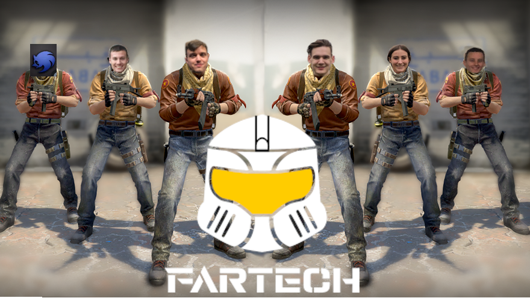

.. Placeholder documentation master file, created by
   sphinx-quickstart on Tue Jan 19 18:18:11 2021.
   You can adapt this file completely to your liking, but it should at least
   contain the root `toctree` directive.

Welcome to FarTech's documentation!
=======================================

In this game you write the soldier AI for a warmongering robot nation state. Your goal is to win as many 1v1 matches against 
other AI's, lest your robot employers find you to be incompetent at your job. Move, shoot, teleport, buy and throw grenades to
secure victory for Amazon ( no relation to the forest ).

.. toctree::
   :maxdepth: 2
   :caption: Contents:

   RunningTheGame
   Server
   Action
   GameBoard
   Movement_Controller
   Kill_boundary_controller
   Loot_Generation_Controller
   Reload_controller
   Shoot_Controller
   Teleporter_Controller
   Teleporter 
   Upgrade_Controller
   Upgrades
   UseController
   consumable
   grenade_controller
   Grenade
   Shooter 
   player_utils
   Wall
   Door
   Hitbox
   Item_Gen_Utils
   Partition Grid
   calculate_new_location
   

Indices and tables
==================

* :ref:`genindex`
* :ref:`modindex`
* :ref:`search`
